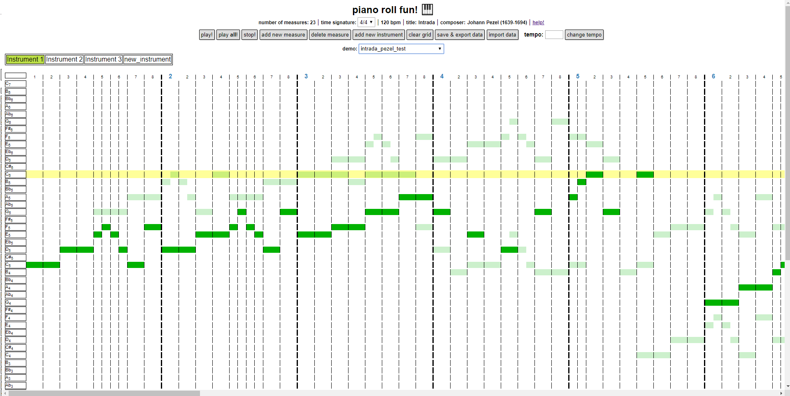

# piano_roll_browser    
a music sequencer inspired by LMMS, one of the best software applications ever!    
also influenced a bit by PxTone Collage, another great application!      
    
This project is a work-in-progress :)        
    
    
     
### instructions:    
- to change the name of the piece or the composer, double click on 'title' or 'composer', just above the buttons.     
- left-click a block on the grid to place a note; click again to remove. Each column can only have one note.    
- right-click a block on the grid to create 16th notes (subdivide), or rejoin 16th notes to revert back to 8th notes. You can also change a note's properties, such as volume and style.    
- right-click an instrument block to modify its sound, name, and volume.    
    
check out a demo! see the demo dropdown box.    
    
### current potential issues:  
can get pretty slow when changing instruments because of the onion skin.    
json loading seems a lot slower in Firefox compared to Chrome?     
    
### current next steps:    
still need to delete instruments.     
be able to start playback at a certain measure.   
be able to toggle onion skin?    
    
### features I would like to implement:    
- ability to change color of highlight and color of note blocks, i.e. different for each instrument    
- be able to make custom sounds!    
- be able to record playback
- be able to repeat a section 
- be able to subdivide 16th notes for 32nd notes.
    
### implementation / design:    

There aren't too many purely HTML piano rolls out there (I think?), but from the ones I've seen, it appears that utilizing the canvas element
is very effective.    
    
My implementation does not use the canvas element and instead relies on just DOM manipulation of a grid to manipulate notes. 
The objective of my piano roll, at least conceptually, is fairly straightforward. The goal is to arrange a number of notes with
varying lengths and pitches with the help of a grid, put these notes in an array, and then feed them to an OscillatorNode so that a musical phrase can be played back.    

To achieve this, I made a function that dynamically creates the grid. Each block in the grid represents one eighth note by default (except for the first block of each column - these are the headers with a special element attribute, "hasnote", which indicates whether or not a column has a selected note or not, indicating a rest). The "hasnote" attribute of each column header makes it easier to know which columns actually have notes (blocks that are green) when it's time to read them (before playback). Otherwise, each note in each column will have to be looked at, which would take too long. Also, in regards to rests between notes, any column, between the first column and the last column with a note, that has a "hasnote" value of 0 is treated as a rest.    
    
Each note's element id tells which column the note is in, whether it may be a 16th note (if a "-1" or "-2" is in the id), and has other attributes such as length and volume. By adding new attributes to elements in the DOM, making changes to the DOM and getting the information I need for setting up the notes becomes easier.    

An important point about the grid is that there is only one grid. Because the most essential data is in the notes array of each instrument, when the user switches instruments, the notes for the current instrument are read by a function, which then edits the grid accordingly to accomodate the notes. But by having to edit the grid each time an instrument is switched, there can be some considerable lag and time spent doing so. This is something I need to think about more. 
    
Additionally, I also created some classes that I think help a lot. First is the Instrument object, which stores some information about an instrument (name, wave type), and most importantly its notes, which is just an array. Next is the Notes object, which holds an ElementNode object, the duration of the note, in milliseconds, and the frequency of the note. The ElementNode object holds the DOM element data of a particular note, such as the id, and custom attributes like length (eighth or sixteenth) and volume. This is necessary because I want to be able to draw back notes of an instrument when switching instruments, or loading a project.    

Another very important feature is the use of custom contextmenus (thanks to <a href="http://swisnl.github.io/jQuery-contextMenu/index.html"> this great jQuery contextmenu plugin </a> ). When right-clicking either the note blocks on the grid or an instrument in the instruments grid, a contextmenu will allow the editing of an instrument's name, wave/sound type, volume, as well as allow the subdivision of a column to make 16th notes or rejoining of two columns. It's not as nice as being allowed to drag a note to an arbitrary length, like in LMMS, but it seems to work out ok. Maybe eventually I'll see if I can get it possible to drag a note to a certain length. 
    
### demos:    
Intrada - Johann Pezel (1639 - 1694). One of my favorite brass quintet pieces!    
    
Sand Canyon (Kirby's Dream Land 3) - Jun Ishikawa
    
3_4_time_example - my own composition

    

